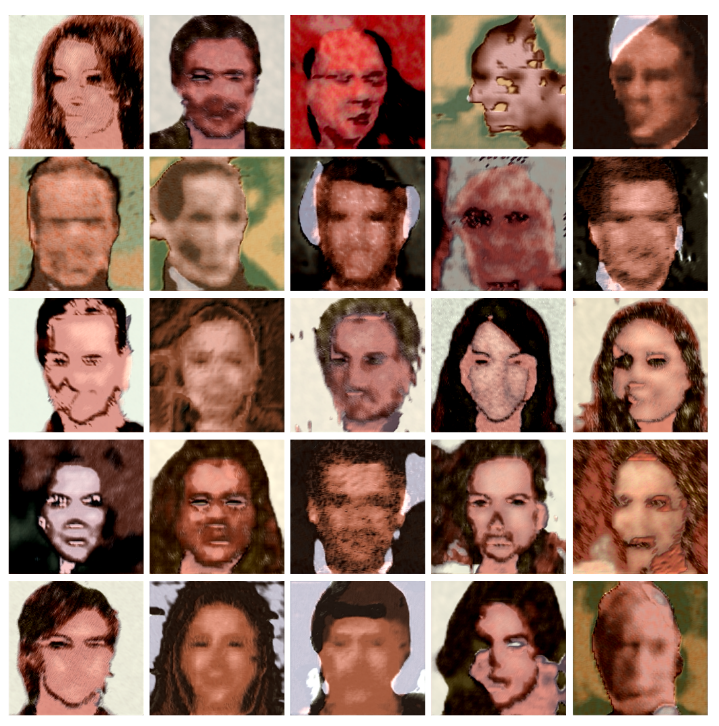

# StyleGAN2 - Tensorflow +2.4.x

## Build StyleGAN2 Model

```python
# default configurations
from stylegan import gan

print(gan.MIN_FILTERS)
print(gan.MAX_FILTERS)

print(gan.MAPPING_CFGS)
print(gan.SYNTHESIS_CFGS)
print(gan.DISCRIMINATOR_CFGS)
```

```python
import tensorflow as tf
from stylegan import gan, functional

# update configurations
mapping_cfgs = {'learning_rate_multiplier': 0.01}
synthesis_cfgs = None # None means use default configurations
discriminator_cfgs = None

# Distributed training with TensorFlow: 
# https://www.tensorflow.org/guide/distributed_training
strategy = tf.distribute.get_strategy()

# Callable to be used for Adaptive Discriminator Augmentation (ADA)
# Can be any callable object that compatible with Tensorflow symbolic graph execution
augmenter = ...

with strategy.scope():
    
    # Construct stylegan2 model using the adjusted configurations
    model = gan.build_stylegan(mapping_cfgs=mapping_cfgs, synthesis_cfgs=synthesis_cfgs, discriminator_cfgs=discriminator_cfgs, 
                               batch_size=None, use_pseudo_labels=False, augmenter=augmenter, 
                               ada_target=1.0, ada_step=25, recursive_lookup=True)
    
    # Specify losses & gradient-penalty
    # Can be any callable object that compatible with Tensorflow symbolic graph execution
    generator_loss = functional.generator_wgan_loss
    discriminator_loss = functional.discriminator_wgan_loss
    
    # None means no gradient_penalty to be used
    gradient_penalty = functional.wgan_gradient_penalty 
    
    # Optimizers initialization
    generator_optimizer = tf.keras.optimizers.Adam(learning_rate=0.002, beta_1=0.0, beta_2=0.99, epsilon=1e-8)
    discriminator_optimizer = tf.keras.optimizers.Adam(learning_rate=0.002, beta_1=0.0, beta_2=0.99, epsilon=1e-8)
    
    # Compile model
    model.compile(generator_optimizer=generator_optimizer, discriminator_optimizer=discriminator_optimizer,
                  generator_loss=generator_loss, discriminator_loss=discriminator_loss, gradient_penalty=gradient_penalty, 
                  clip_min=None, clip_max=None, use_clip=False, run_eagerly=False)
    
    # Loading a previous checkpoint
    # model.load_weights('path/ckpt.h5')
```

## Processing Module

```python
from stylegan import processing

images = ...

# set pixels to be in range [-1, 1]
x = processing.normalize(images)

# invert processing.normalize(...), i.e., set pixels to be in range [0, 255] 
y = processing.denormalize(x)
```

## Helpers Module
```python
from stylegan import helpers

""" helpers.set_dynamic_level(...) - Used for loss scaling:

Ensure that losses never get beyond specific level in a dynamic way. This makes
 a stable training possible without involving normalization into our network. 
    
    . This function follows a pretty simple heuristic to choose the scaling value 
      to be relative to log10(...)
"""

print(helpers.set_dynamic_level(-10.412412, min_level=-1, max_level=1))
print(helpers.set_dynamic_level(10.53532, min_level=-1, max_level=1))
print(helpers.set_dynamic_level(-5342.42141, min_level=-1, max_level=1))
print(helpers.set_dynamic_level(0.42141, min_level=-1, max_level=1))
print(helpers.set_dynamic_level(0.0042141, min_level=-1, max_level=1))

"""
Acknowledgment:

I have no idea if the heuristic used for loss scaling exists or not,
if so, I would be happy to get a link to this reference.
 
Also, most of the experiments that have been made demonstrate that it works fine. 
However, I believe they not sufficient.
"""
```

## Experiment v0.0 

-------

> ### Datasets
>>* [CelebA-HQ](https://drive.google.com/drive/folders/11Vz0fqHS2rXDb5pprgTjpD7S2BAJhi1P)

> ### Notebooks
>>* [Training](results/StyleGAN2-CelebA-HQ-[GPU-Training]-v0/notebooks/gpu-training.ipynb)
>>* Evaluation (TODO)
>>* Testing (TODO)

> ### 256 x 256 - Results
>> ### After 100 Epochs
>> 
Commonly it requires about +300 epochs to get good results. 
A training epoch with a `batch-size=4`, and `num-batches-per-epoch=7500`, takes about `1 hour` and `10 minutes` on average.